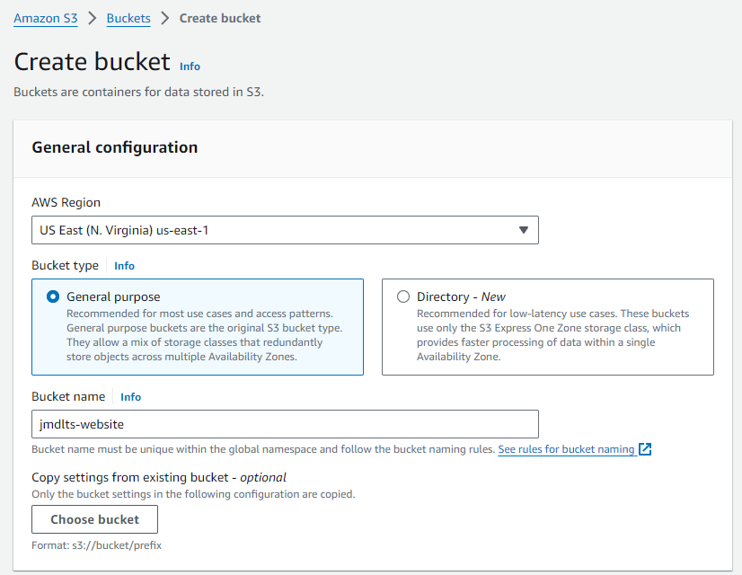
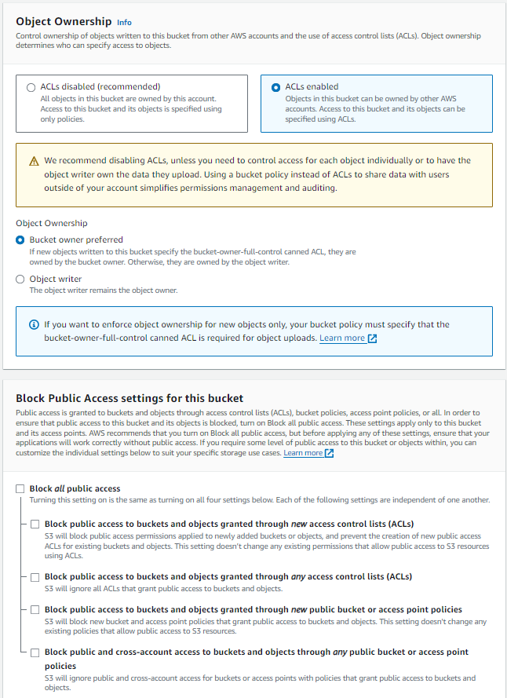
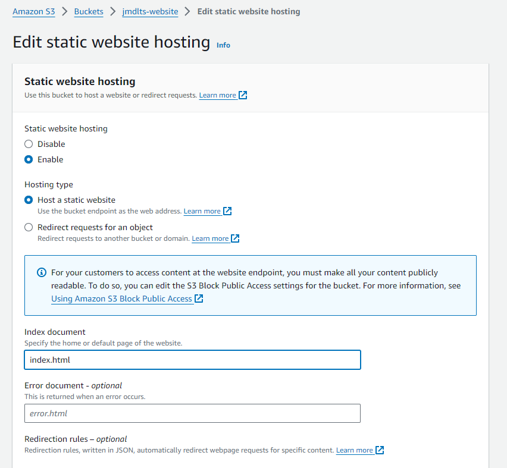
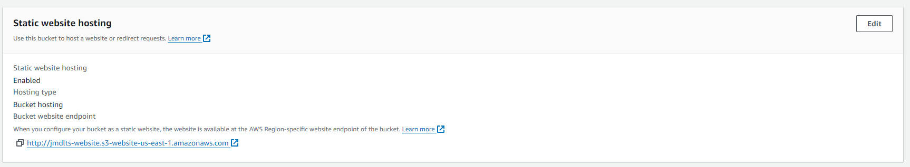
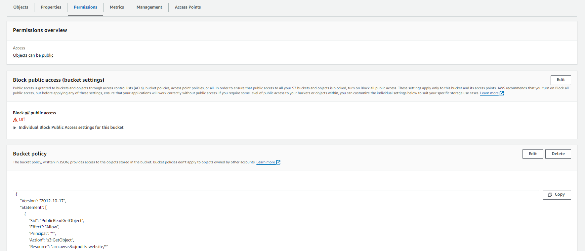
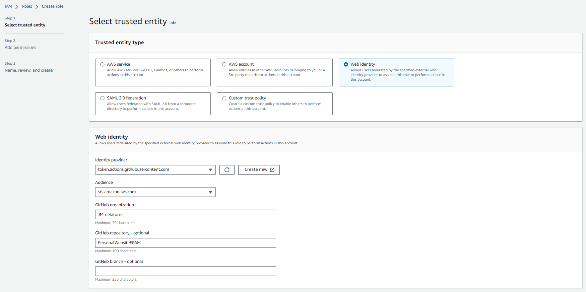
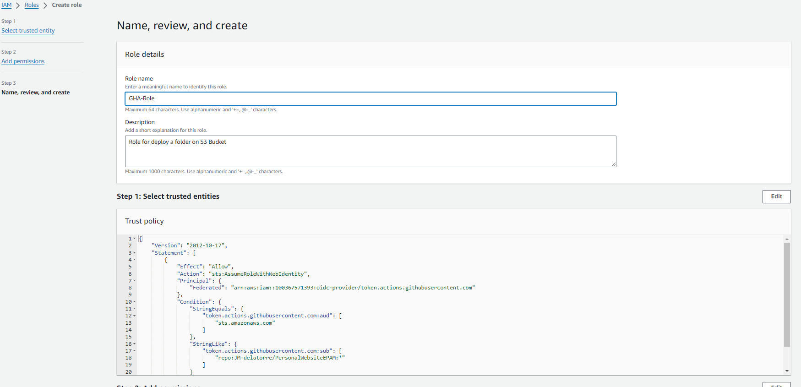
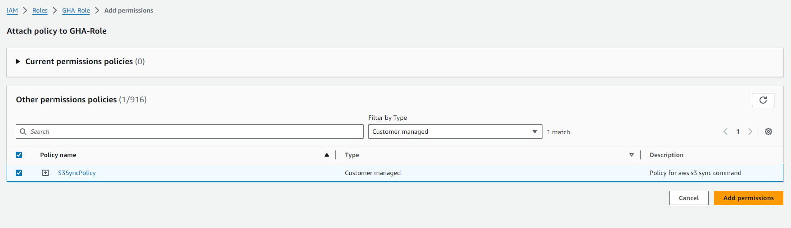
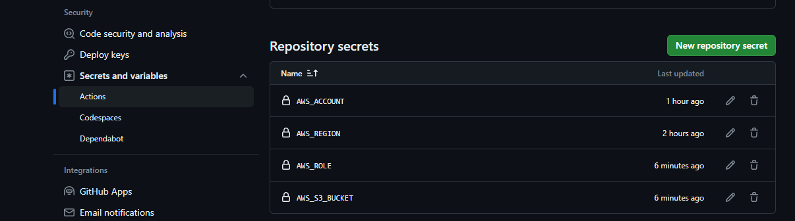
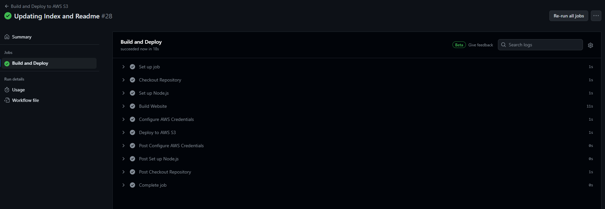

# Personal Static Website on S3

Build with astro and deployed on S3 with github actions

## Table of Contents
- [Project Structure](#-project-structure)
- [AWS Setup](#aws-setup)
  - [Create S3 Bucket](#create-s3-bucket)
  - [SetUp AWS Role](#setup-aws-role)
- [GitHub SetUp](#github-setup)
- [Local Dev](#local-dev)
  - [Commands](#-commands)


## 🚀 Project Structure

```text
/
├── .github/
│   └── workflows/
│       └── deploy.yml
├── public/
│   └── favicon.svg
├── src/
│   ├── components/
│   │   └── Card.astro
│   ├── layouts/
│   │   └── Layout.astro
│   └── pages/
│       └── index.astro
└── package.json
```

## AWS Setup

### Create S3 Bucket

First Create the bucket



For ACL and public access ensure that the first one is enabled and that the public access is granted (this for GHA to work and for the website to work to)



Leave the rest of the options on default

Now that is created go to the propierties of your bucket and find the Static Website Hosting section and edit it




Now go to the permissions tab, and in the bucket policy add the next json

```json
{
    "Version": "2012-10-17",
    "Statement": [
        {
            "Sid": "PublicReadGetObject",
            "Effect": "Allow",
            "Principal": "*",
            "Action": "s3:GetObject",
            "Resource": "arn:aws:s3:::<Your-bucket-name>/*"
        }
    ]
}
```


### SetUp AWS Role

To make AWS and GHA to interact with each other first we need to create an identity provider


Then we can create a role with the next config

In the Github organization we can put our github user in case we are using our personal account

And in the repository, the one that will trigger the workflow



Skip the part of the permisions we will check that later. Then add a name for our Role and verify that the trusted entity is correct



Go to the policies section and create a new one


Select JSON and copy and paste the next policy 

```json
{
    "Version": "2012-10-17",
    "Statement": [
        {
            "Sid": "S3SyncPolicy",
            "Effect": "Allow",
            "Action": [
                "s3:PutObject",
                "s3:GetObject",
                "s3:ListBucket",
                "s3:DeleteObject",
                "s3:PutObjectAcl"
            ],
            "Resource": [
              "arn:aws:s3:::<your-bucket-name>",
              "arn:aws:s3:::<your-bucket-name>/*"
            ]
        }
    ]
}
```

Once created, return to the role and attach this new policy to the role



For further understanding, you can check the following links:

- [Configuring OpenID Connect in Amazon Web Services](https://docs.github.com/en/actions/deployment/security-hardening-your-deployments/configuring-openid-connect-in-amazon-web-services)
- [Create an Identity Provider for IAM Roles](https://docs.aws.amazon.com/IAM/latest/UserGuide/id_roles_providers_create_oidc.html)
- [Use IAM Roles to Connect GitHub Actions to Actions in AWS](https://aws.amazon.com/blogs/security/use-iam-roles-to-connect-github-actions-to-actions-in-aws/)

## GitHub SetUp

Now you just need to update the secrets in the repository with the respective values

Go to setting of your repository and select actions under the secrets and variables



| SECRET        | VALUE                                                             |
| :------------ | :---------------------------------------------------------------- |
| AWS_ACCOUNT   | Numeric Value of your account you can get it from the Role ARN    |
| AWS_REGION    | Region of the Bucket, your can check it in the Bucket propierties |
| AWS_ROLE      | Name of the role that is already created                          |
| AWS_S3_BUCKET | Name of the s3 bucket                                             |

Now just push a new commit to the repo and wait for the workflow to finish



## Local Dev

For local development first you need to have node installed then you can use the next commands

### 🧞 Commands

All commands are run from the root of the project, from a terminal:

| Command                   | Action                                           |
| :------------------------ | :----------------------------------------------- |
| `npm install`             | Installs dependencies                            |
| `npm run dev`             | Starts local dev server at `localhost:4321`      |
| `npm run build`           | Build your production site to `./dist/`          |
| `npm run preview`         | Preview your build locally, before deploying     |
| `npm run astro ...`       | Run CLI commands like `astro add`, `astro check` |
| `npm run astro -- --help` | Get help using the Astro CLI                     |
